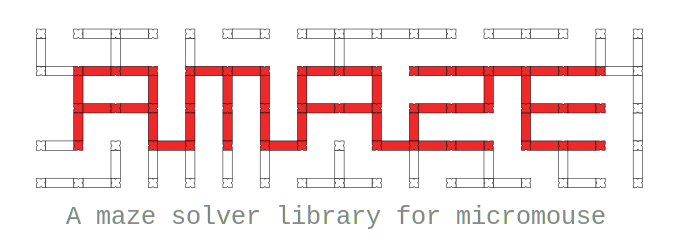

libamaze (Amaze)  
============

マイクロマウス向けの迷路探索C++ライブラリ

A maze solver C++ library for micromouse

## 概要

迷路探索ロボット「マイクロマウス」の開発用に作成した，汎用迷路探索ライブラリです．

以下のような特徴があります．
- 同一の迷路に対して複数のグラフ表現を考慮できる
- 同一のグラフ表現に対して複数の最短経路ソルバを使用できる
- 標準よりも大きな迷路への拡張が容易である

また，組み込み環境での利用を想定して，以下の点に注意して実装しています．
- メモリはなるべく静的に確保する(壁の枚数やノードの個数はコンパイル時定数)
- `__attribute__((__packed__))` の利用
- 整数型のビット数の規定

## 構造

Amazeは主に3つの基本クラスで構成されています．

- `Maze`  
迷路データを表すクラスです．テンプレート引数によって最大の迷路幅を指定できます．使用するメモリはコンパイル時に決定され，静的に確保されます．
- `MazeGraph`  
`Maze` クラスで表現された迷路の壁データをもとにグラフを構成します． `MazeGraph` は抽象クラスであり，`FourWayStepMapGraph`, `SixWayWallNodeGraph`, `SixWayWallNodeTurnCostGraph` が具体的に実装しています．
- `Solver`  
`MazeGraph` 上を探索するソルバです．迷路データである `Maze` 自身は参照せず，`MazeGraph` を通して迷路を解釈します．`AStar`, `BFS`, `DStarLite` が具体的な実装を提供しています．

また，計算機上でのシミュレーションのためのヘルパークラスも用意しています．
- `AgentHelper`  
仮想的な壁のセンシングや状態管理を行うヘルパーです．

## 使用例

`samples` をご覧ください．

## 開発

C++17に対応したコンパイラが必要です．

ビルド環境
- g++ 9.2 以降

## 発展的な使い方

`MazeGraph`, `Solver` を実装することで，独自の迷路のグラフ表現や最短経路ソルバを使用できます．

---

## Abstract

## Structure

## Example

## Development

## Advanced Usage
